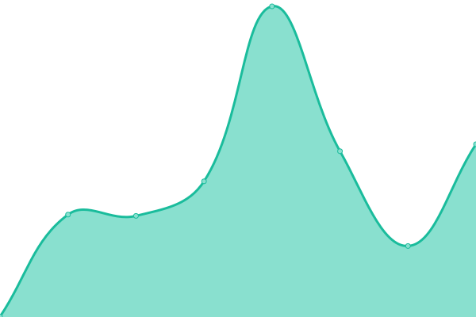

# [📈 Live Status](https://status.cozify.io): <!--live status--> **🟩 All systems operational**

<!--start: status pages-->
<!-- This summary is generated by Upptime (https://github.com/upptime/upptime) -->
<!-- Do not edit this manually, your changes will be overwritten -->
<!-- prettier-ignore -->
| URL | Status | History | Response Time | Uptime |
| --- | ------ | ------- | ------------- | ------ |
|  [www.cozify.fi](https://www.cozify.fi) | 🟩 Up | [www-cozify-fi.yml](https://github.com/cozify/status/commits/HEAD/history/www-cozify-fi.yml) | 

 574ms
     
 | 

<a href="https://status.cozify.io/history/www-cozify-fi">99.78%</a>
    

|  [one.cozify.fi](https://one.cozify.fi/_/health) | 🟩 Up | [one-cozify-fi.yml](https://github.com/cozify/status/commits/HEAD/history/one-cozify-fi.yml) | 

 734ms
     
 | 

<a href="https://status.cozify.io/history/one-cozify-fi">100.00%</a>
    

|  [one.cozify.io](https://one.cozify.io/_/health) | 🟩 Up | [one-cozify-io.yml](https://github.com/cozify/status/commits/HEAD/history/one-cozify-io.yml) | 

 529ms
     
 | 

<a href="https://status.cozify.io/history/one-cozify-io">100.00%</a>
    

|  [hubs.cozify.io](https://hubs.cozify.io/_/health) | 🟩 Up | [hubs-cozify-io.yml](https://github.com/cozify/status/commits/HEAD/history/hubs-cozify-io.yml) | 

 557ms
     
 | 

<a href="https://status.cozify.io/history/hubs-cozify-io">100.00%</a>
    

|  [login.cozify.fi](https://login.cozify.fi) | 🟩 Up | [login-cozify-fi.yml](https://github.com/cozify/status/commits/HEAD/history/login-cozify-fi.yml) | 

 526ms
     
 | 

<a href="https://status.cozify.io/history/login-cozify-fi">100.00%</a>
    

|  [webui.cozify.fi](https://webui.cozify.fi) | 🟩 Up | [webui-cozify-fi.yml](https://github.com/cozify/status/commits/HEAD/history/webui-cozify-fi.yml) | 

 373ms
     
 | 

<a href="https://status.cozify.io/history/webui-cozify-fi">100.00%</a>
    

|  [portal.cozify.fi](https://portal.cozify.fi) | 🟩 Up | [portal-cozify-fi.yml](https://github.com/cozify/status/commits/HEAD/history/portal-cozify-fi.yml) | 

 250ms
     
 | 

<a href="https://status.cozify.io/history/portal-cozify-fi">100.00%</a>
    

|  [preview-webui.cozify.fi](https://preview-webui.cozify.fi) | 🟩 Up | [preview-webui-cozify-fi.yml](https://github.com/cozify/status/commits/HEAD/history/preview-webui-cozify-fi.yml) | 

 281ms
     
 | 

<a href="https://status.cozify.io/history/preview-webui-cozify-fi">100.00%</a>
    

|  [preview-portal.cozify.fi](https://preview-portal.cozify.fi) | 🟩 Up | [preview-portal-cozify-fi.yml](https://github.com/cozify/status/commits/HEAD/history/preview-portal-cozify-fi.yml) | 

 347ms
     
 | 

<a href="https://status.cozify.io/history/preview-portal-cozify-fi">100.00%</a>
    

|  [api.cozify.fi](https://api.cozify.fi) | 🟩 Up | [api-cozify-fi.yml](https://github.com/cozify/status/commits/HEAD/history/api-cozify-fi.yml) | 

 498ms
     
 | 

<a href="https://status.cozify.io/history/api-cozify-fi">98.96%</a>
    

|  [cloud.cozify.fi](https://cloud.cozify.fi) | 🟩 Up | [cloud-cozify-fi.yml](https://github.com/cozify/status/commits/HEAD/history/cloud-cozify-fi.yml) | 

 483ms
     
 | 

<a href="https://status.cozify.io/history/cloud-cozify-fi">99.73%</a>
    

|  [videoondemand.cozify.fi](https://videoondemand.cozify.fi) | 🟩 Up | [videoondemand-cozify-fi.yml](https://github.com/cozify/status/commits/HEAD/history/videoondemand-cozify-fi.yml) | 

 655ms
     
 | 

<a href="https://status.cozify.io/history/videoondemand-cozify-fi">100.00%</a>
    

|  [videostreaming.cozify.fi](https://videostreaming.cozify.fi) | 🟩 Up | [videostreaming-cozify-fi.yml](https://github.com/cozify/status/commits/HEAD/history/videostreaming-cozify-fi.yml) | 

 457ms
     
 | 

<a href="https://status.cozify.io/history/videostreaming-cozify-fi">100.00%</a>
    

<!--end: status pages-->

[**Visit our status website →**](https://status.cozify.io)

## 📄 License

- Powered by: [Upptime](https://github.com/upptime/upptime)
- Code: [MIT](./LICENSE) © [Cozify](https://cozify.fi/)
- Data in the `./history` directory: [Open Database License](https://opendatacommons.org/licenses/odbl/1-0/)
